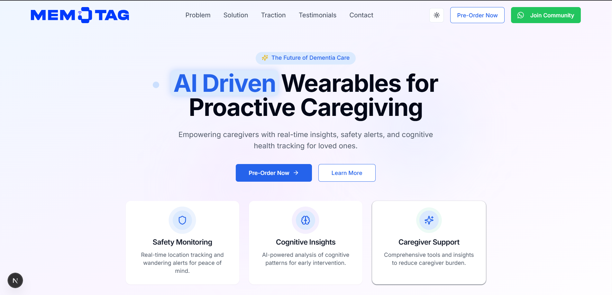
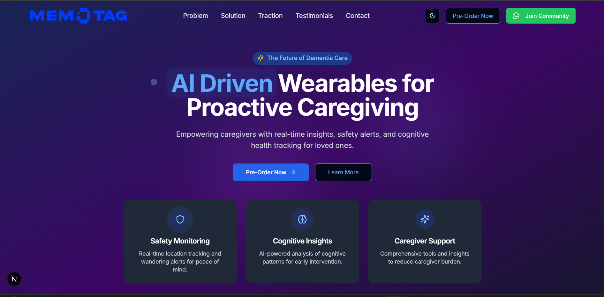

# MemoTag - AI-Powered Dementia Care Platform

## Overview

MemoTag is a modern, responsive website for an AI-powered wearable device designed to revolutionize dementia care. The platform provides caregivers with real-time insights, safety alerts, and cognitive health tracking for loved ones with dementia.

## Preview

### 🌓 Light & Dark Mode Homepages

  
   
  <em>Light Mode</em>
    
  
   
  <em>Dark Mode</em>

## Live Demo

[View Live Demo](https://memotag-jai.vercel.app/) <!-- Replace with actual demo link when deployed -->

## Key Features

### 🎯 User Interface

- **Modern Design**: Clean, professional interface with consistent visual language
- **Dark/Light Mode**: Full theme support with smooth transitions between modes
- **Responsive Layout**: Optimized for all device sizes from mobile to desktop
- **Animated Components**: Subtle animations and transitions for enhanced user experience
- **Accessibility**: ARIA-compliant with keyboard navigation support

### 🚀 Technical Features

- **Next.js App Router**: Built with the latest Next.js features
- **Server Components**: Optimized rendering with React Server Components
- **Supabase Integration**: Backend database for waitlist and contact form submissions
- **Framer Motion**: Advanced animations and transitions
- **Tailwind CSS**: Utility-first styling with custom theme configuration
- **TypeScript**: Type-safe code throughout the application

### 📱 Website Sections

1. **Hero Section**: Engaging introduction with animated elements
2. **Problem Section**: Data-driven overview of dementia care challenges
3. **Solution Section**: Detailed explanation of MemoTag's approach
4. **Traction Section**: Metrics and statistics showcasing impact
5. **Testimonials Section**: Carousel of user testimonials with auto-rotation
6. **CTA Section**: Call-to-action with waitlist signup
7. **Footer**: Comprehensive site navigation and contact information

### 🔄 Interactive Elements

- **Waitlist Form**: Email submission with validation and success/error states
- **Contact Form**: Detailed contact form with role selection and validation
- **Testimonial Carousel**: Interactive testimonial slider with auto-rotation
- **Smooth Scrolling**: Section-to-section navigation with scroll animations
- **Hover Effects**: Interactive elements with engaging hover states

## Animation & Transition Effects

The website features numerous subtle animations and transitions:

- **Background Bubbles**: Floating animated gradient bubbles across all sections
- **Scroll Animations**: Elements that animate into view as the user scrolls
- **Hover Transitions**: Interactive elements with smooth hover state transitions
- **Page Load Animations**: Staggered entrance animations when the page loads
- **Button Animations**: Directional animations on buttons for enhanced interactivity
- **Theme Transitions**: Smooth transitions between light and dark modes
- **Card Hover Effects**: Elevation and scale changes on interactive cards
- **Icon Animations**: Subtle animations on icons throughout the site

## Responsive Design

The website is fully responsive across all device sizes:

- **Mobile-First Approach**: Optimized for small screens first
- **Adaptive Layouts**: Layout changes based on screen size
- **Flexible Components**: UI components that adapt to available space
- **Responsive Typography**: Font sizes that scale with viewport
- **Touch-Friendly**: Large touch targets for mobile users
- **Optimized Images**: Properly sized images for different devices

## Accessibility Features

- **Semantic HTML**: Proper use of HTML5 semantic elements
- **ARIA Attributes**: Accessibility attributes for interactive elements
- **Keyboard Navigation**: Full keyboard support for navigation
- **Screen Reader Support**: Text alternatives for visual elements
- **Focus States**: Visible focus indicators for keyboard users
- **Color Contrast**: WCAG-compliant color contrast ratios

## Getting Started

### Prerequisites

- Node.js 18.0.0 or later
- npm or yarn

### Installation

1. Clone the repository:
   \`\`\`bash
   git clone https://github.com/yourusername/memotag-website.git
   cd memotag-website
   \`\`\`

2. Install dependencies:
   \`\`\`bash
   npm install
   # or
   yarn install
   \`\`\`

3. Set up environment variables:
   Create a `.env.local` file in the root directory with the following variables:
   \`\`\`
   NEXT_PUBLIC_SUPABASE_URL=your_supabase_url
   NEXT_PUBLIC_SUPABASE_ANON_KEY=your_supabase_anon_key
   SUPABASE_SERVICE_ROLE_KEY=your_supabase_service_role_key
   \`\`\`

4. Run the development server:
   \`\`\`bash
   npm run dev
   # or
   yarn dev
   \`\`\`

5. Open [http://localhost:3000](http://localhost:3000) in your browser to see the result.

## Technologies Used

- **Frontend Framework**: [Next.js 14](https://nextjs.org/)
- **UI Library**: [React 18](https://reactjs.org/)
- **Styling**: [Tailwind CSS](https://tailwindcss.com/)
- **Animations**: [Framer Motion](https://www.framer.com/motion/)
- **Database**: [Supabase](https://supabase.io/)
- **Language**: [TypeScript](https://www.typescriptlang.org/)
- **UI Components**: [shadcn/ui](https://ui.shadcn.com/)
- **Fonts**: [Google Fonts](https://fonts.google.com/) (Inter, Playfair Display)
- **Icons**: [Lucide React](https://lucide.dev/)

## Deployment

This project is configured for easy deployment on [Vercel](https://vercel.com/).

## License

This project is licensed under the MIT License - see the LICENSE file for details.

## Acknowledgements

- Design inspiration from modern healthcare and technology websites
- Icons provided by [Lucide React](https://lucide.dev/)
- UI components from [shadcn/ui](https://ui.shadcn.com/)
